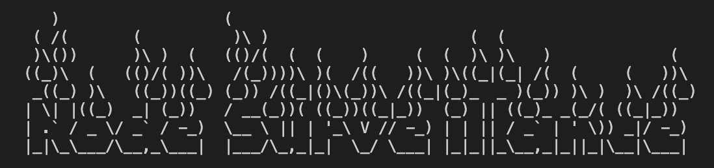
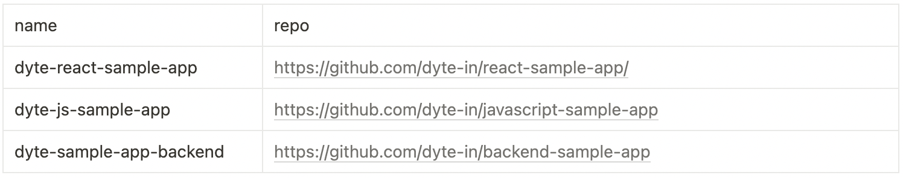
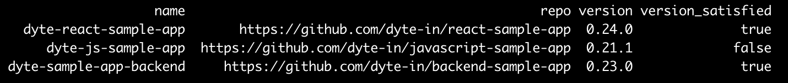
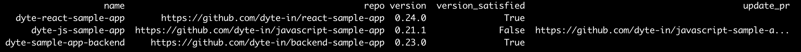

# Node Surveillance Tool

> Author: Chirag Ganguli <br>
> University: Vellore Institute of Technology, Bhopal <br>
> Last Revised: 01 June, 2022 <br>


<br>
This is a tool prepared for the SDK Tooling Challenge by Dyte. The tool can fetch versions of node packages from remote GitHub repositories (both private and public repositories) and then check if they match with the user-inserted package version. In case the existing packages are of an older version, they can be automatically updated by the -update argument when inserted in the command line by the user, following which a PR will be created for the Node Version Update.

## Usage

```python3
python3 nodemonitorr.py
```

usage: nodemonitorr.py [-h] -i INPUT [-u] [-v VERSION]
nodemonitorr.py: the following arguments are required: -i/--input

## Requirements

- Node
- Python3
- shutil
- argparse
- pandas
- openpyxl

For any package installation, use `pip3 install package-name`.


## Steps to Run the Script

For verifying the package version satisfaction, use the following command:

```python3
python3 nodemonitorr.py -i nodemonitordata.csv -v axios@0.23.0
```

Here, `-i` is used for the input file name, which is a csv file containing name and repository information. It should look similar to:
 <br>
|name                   |repo                                            |
|-----------------------|------------------------------------------------|
|dyte-react-sample-app  |https://github.com/dyte-in/react-sample-app     |
|dyte-js-sample-app     |https://github.com/dyte-in/javascript-sample-app|
|dyte-sample-app-backend|https://github.com/dyte-in/backend-sample-app   |

and `-v` is used to input package_name@version to check the existing package version against.

This will generate a csv file similar to:
 <br>
|name                   |repo                                            |version|version_satisfied|
|-----------------------|------------------------------------------------|-------|-----------------|
|dyte-react-sample-app  |https://github.com/dyte-in/react-sample-app     |0.24.0 |True             |
|dyte-js-sample-app     |https://github.com/dyte-in/javascript-sample-app|0.21.1 |False            |
|dyte-sample-app-backend|https://github.com/dyte-in/backend-sample-app   |0.23.0 |True             |


In order to update the package of the outdated repository to the package version as inserted by the user, simple include the `-u` flag.

```python3
python3 nodemonitorr.py -i nodemonitordata.csv -v axios@0.23.0 -u
```

This will update the node package and create a PR to the remote repository with the updated package. To achieve this, Git CLI needs to be installed in the local machine. <br>
For more information and installation details, check out https://cli.github.com

The above command will generate an output similar to the following:


Finally, on execution of the script, a `finaloutput.csv` file will be generated containing the final required output of the script which looks very similar to:

|name                   |repo                                            |version|version_satisfied|update_pr                                               |
|-----------------------|------------------------------------------------|-------|-----------------|--------------------------------------------------------|
|dyte-react-sample-app  |https://github.com/dyte-in/react-sample-app     |0.24.0 |True             |                                                        |
|dyte-js-sample-app     |https://github.com/dyte-in/javascript-sample-app|0.21.1 |False            |https://github.com/dyte-in/javascript-sample-app/pull/95|
|dyte-sample-app-backend|https://github.com/dyte-in/backend-sample-app   |0.23.0 |True             |                                                        |

Along with the csv files, xlsx files are also generated to open the output in Microsoft Excel. This feature is included solely for cross compatibility and better visualization of the data.


## Script Testing Environment

The script is tested on both Linux and MacOS machines (I don't have Windows so .., but even for Windows this script will run but few default packages need to be installed using the command `pip3 install command-name`) and it works as per the required expectations. <br>

Paths in Line 25 and 26 needs to be updated manually based on the OS used by the user.

## Languages used:

- Python
- Node

## Conclusion

This code was run natively on MacOS and was tested on a Linux Docker Container. Therefore, all the packages used were installed from scratch and no new packages were available pre-installed in the Docker container. So, the script is expected to run as it is without any manual code edits except for Line 25 and 26 where the path needs to be mentioned in accordance to the OS or environment, the script is executed on.